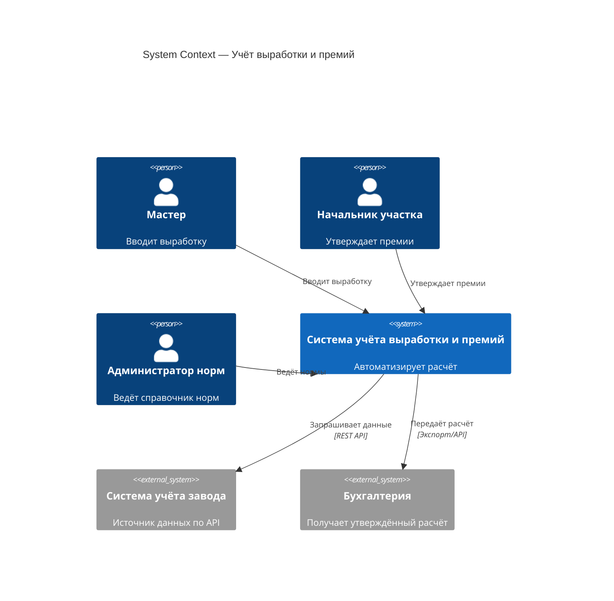

# C4 Context

```mermaid
C4Context
  title System Context — Учёт выработки и премий

  Person(master, "Мастер", "Вводит выработку")
  Person(manager, "Начальник участка", "Утверждает премии")
  Person(admin, "Администратор норм", "Ведёт справочник норм")

  System(system, "Система учёта выработки и премий", "Автоматизирует расчёт")

  System_Ext(factory, "Система учёта завода", "Источник данных по API")
  System_Ext(accounting, "Бухгалтерия", "Получает утверждённый расчёт")

  Rel(master, system, "Вводит выработку")
  Rel(manager, system, "Утверждает премии")
  Rel(admin, system, "Ведёт нормы")
  Rel(system, factory, "Запрашивает данные", "REST API")
  Rel(system, accounting, "Передаёт расчёт", "Экспорт/API")
```